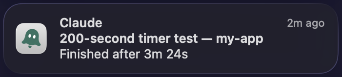

<p align="center">
  
</p>

<h1 align="center">ai-ghostty-notifier</h1>

<p align="center">
  <b>A long Claude Code or Codex CLI task just finished — macOS tells you, and one click takes you back to that exact Ghostty tab.</b>
</p>

<p align="center">
  <a href="https://github.com/Davie521/ai-ghostty-notifier/actions/workflows/ci.yml"></a>
  <a href="https://github.com/Davie521/ai-ghostty-notifier/releases/latest"></a>
  <a href="LICENSE"></a>
  <a href="#install"></a>
</p>

<p align="center"><a href="README.md">English</a> · <a href="README.zh-CN.md">中文</a></p>

<p align="center">
  
</p>

You start a long task, switch to the browser, and forget about it. When it
ends, a notification tells you which session finished and how long it took.
**Go to tab** brings that session's tab forward, even with several sessions open
in the same project.

## Features

- **Only when it is worth it.** Under 3 minutes: nothing. 3–10 minutes: a
  silent notification. 10 minutes or more: with sound. The thresholds are
  [configurable](docs/reference.md#configuration).
- **Back to the exact tab.** Tabs are told apart by session, not by project
  folder, so several sessions in one repository still land in the right place.
- **Claude Code and Codex CLI**, each notification under its session's own title.
- **Gets out of the way.** Return to the tab or send another prompt and the
  notification disappears; one nobody answers expires after 20 minutes.
- **A menu bar list** of the sessions waiting on you.
- **In your language.** Notifications and the menu bar in English or Simplified
  Chinese, following macOS.
- **Nothing extra.** No Node, no telemetry, no Accessibility permission.

## Install

One command installs the current release: a signed, notarized build, no clone,
no Swift toolchain. It installs the app, then registers the hooks for whichever
of Claude Code and Codex CLI it finds, without touching anything else in their
settings.

```bash
curl -fsSL https://github.com/Davie521/ai-ghostty-notifier/releases/latest/download/setup.sh | bash
```

Or hand the job to your agent. Paste this into Claude Code or Codex CLI:

```text
Install https://github.com/Davie521/ai-ghostty-notifier on this Mac.
Clone it, then follow docs/agent-install.md exactly, including its checks,
and finish by telling me the steps only I can do.
```

The agent installs from the release, or builds from source when it has to, and
checks every step ([what it follows](docs/agent-install.md)). Either way, two
things stay with you: allowing the notification and Automation permissions, and
restarting the CLI sessions you already have open.

**Requirements:** macOS 13 or later, [Ghostty](https://ghostty.org) with
AppleScript support, and Claude Code or Codex CLI. A Swift 6 toolchain is
needed only to build from source.

## Docs

[Manual install](docs/reference.md#manual-install) ·
[Behavior in detail](docs/reference.md#behavior) ·
[Configuration](docs/reference.md#configuration) ·
[How it works](docs/reference.md#how-it-works) ·
[Troubleshooting](docs/reference.md#troubleshooting-and-limits) ·
[Uninstall](docs/reference.md#uninstall)

## Credits and license

Inspired by the Claude Code notification ecosystem, including the TTY-marker
idea discussed in [claude-code-notifier](https://github.com/kovoor/claude-code-notifier).

[MIT with the Commons Clause](LICENSE). Use it anywhere, at work included,
change it and share your changes. What you may not do is sell it, or sell a
product or service whose value comes entirely or substantially from it; paid
hosting, consulting and support count as selling. For a commercial license,
write to [daviefan@outlook.com](mailto:daviefan@outlook.com).

Everything released before this condition was added, up to and including
v0.5.1, stays under the plain MIT License.
